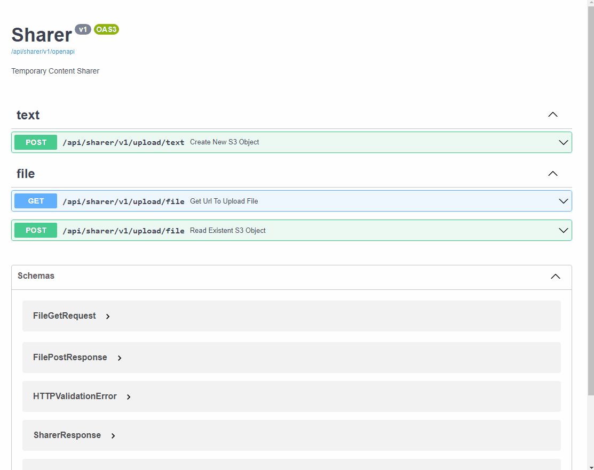

<div align="center">
  <h1 align="center">TEMP CONTENT SHARER</h1>
</div>

<details open="open">
  <summary>Table of Contents</summary>
  <ol>
    <li><a href="#about">About</a></li>
    <li><a href="#usage">Usage</a></li>
    <li><a href="#installation">Installation</a></li>
    <li><a href="#contributing">Contributing</a></li>
    <li><a href="#license">License</a></li>
  </ol>
</details>

## About

Web interface and API for sharing temporary content with AWS S3 using presigned URL to download and upload objects



#### Motivation
The need to share secrets and confidential files without exposing them forever as in the case of an email and without having to manually delete them, as in the case of a slack message for example

So the objective of this project is to share the URL of secrets and files that expire after a certain time, using a secure mechanism (private S3) without having to expose the file or plain text in a place and having to delete it. it manually when possible

#### Built With

- **Back**: Python3 with FastAPI
- **Front**: HTML, CSS, JS

## Usage

### Back-end

Set the environment variables:

```bash
export BUCKET_NAME=YOUR-PERSONAL-BUCKET-NAME
export ORIGINS=["http://your-front-end-url"]
```

Run API:

```bash
cd api/
python3 -m uvicorn main:app --reload
```

### Front-end
Update the constant variable in `script.js` that references the back-end API URL:

```javascript
const api = {
    base: "http://127.0.0.1:8000/api/sharer/v1"
}
```

## Installation

#### 1. Install python and pip
```
sudo apt install python3 && python3-pip
```

#### 2. Clone git repository
```
git clone git@github.com:almeida-matheus/temp-content-sharer.git
```

#### 3. Install requeriments
```
pip3 install api/requeriments.txt
```

## Contributing
1. Fork the project
2. Create your branch (`git checkout -b branch-name`)
3. Add your changes (`git add .`)
4. Commit your changes (`git commit -m 'add some feature'`)
5. Push to the branch (`git push origin branch-name`)
6. Open a pull request

## License
Distributed under the MIT License. See [LICENSE](LICENSE) for more information.